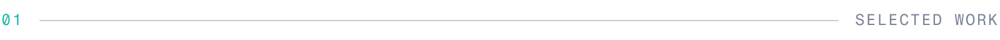
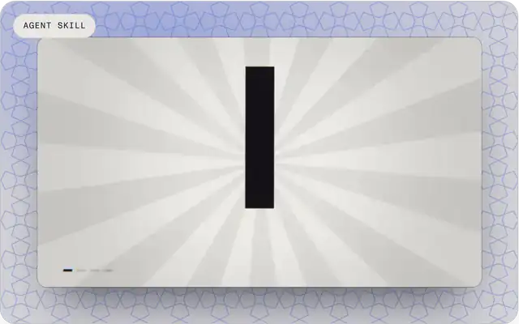
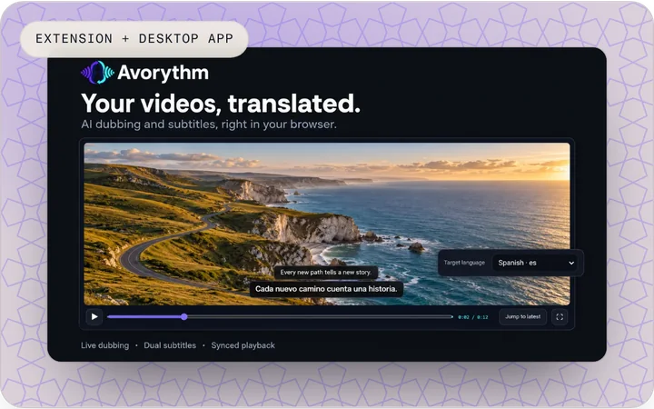
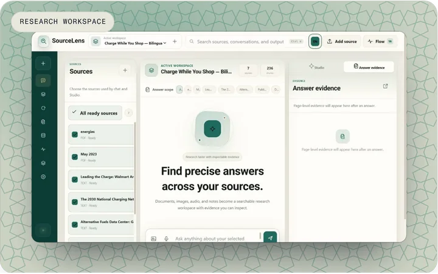
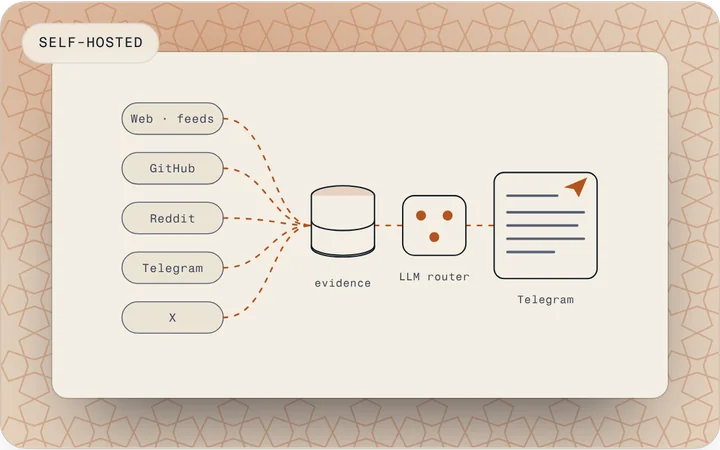
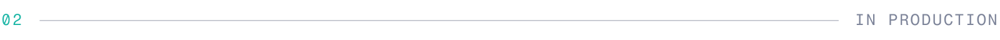
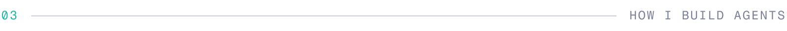
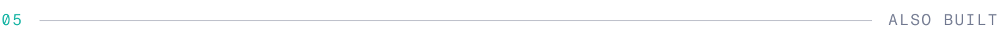

  <a href="https://msmahdinejad.github.io/msmahdinejad/">
    <picture>
      <source media="(prefers-color-scheme: dark)" srcset="https://raw.githubusercontent.com/msmahdinejad/msmahdinejad/main/assets/hero-dark.webp">
      
    </picture>
  </a>

**I build agents that cite their sources, ask before they act, and survive a restart.**

I'm Mohammad Saleh, a full-stack developer and computer engineering student at the University of Isfahan. Most of what I build has a model somewhere inside it, but the part that decides whether it holds up is everything around the model: retrieval that finds the right page, a queue that survives a crash, a confirmation step before anything irreversible.

I work in Persian and English, and so do the tools I make.

  
  
  
  

<h3></h3>

<table>
  <tr>
    <td width="50%" valign="top">
      
      <h3><a href="https://github.com/msmahdinejad/cinewright">Cinewright</a></h3>
      
<em>Teaches coding agents to make cinema-grade video, entirely from code.</em>

      
An agent skill for Codex, Claude Code and friends: 239 techniques, 32 transitions, a from-scratch 3D renderer and a sound engine. Every frame is a pure function of time, so an agent can render one, look at it, fix a number and try again.

      
<code>JavaScript</code> <code>WebGL</code> <code>Node.js</code> <code>FFmpeg</code>

      
<a href="https://msmahdinejad.github.io/cinewright/">Website</a> · <a href="https://github.com/msmahdinejad/cinewright">GitHub</a>

    </td>
    <td width="50%" valign="top">
      
      <h3><a href="https://github.com/msmahdinejad/avorythm">Avorythm</a></h3>
      
<em>Hear every voice, or just read it, in your language.</em>

      
Live translation and dubbing for desktop and browser audio. A Chrome and Edge extension and a desktop app for Windows, macOS and Linux, with original audio, dub, source subtitles and translated subtitles as four independent outputs. No telemetry.

      
<code>Python</code> <code>JavaScript</code> <code>Gemini</code> <code>Groq Whisper</code> <code>FFmpeg</code> <code>Chrome MV3</code>

      
<a href="https://chromewebstore.google.com/detail/avorythm-live-translation/kbdbbedijheicmmnmoidamdaodjbhjje">Chrome Web Store</a> · <a href="https://github.com/msmahdinejad/avorythm">GitHub</a> · <a href="https://github.com/msmahdinejad/avorythm/releases">Releases</a>

    </td>
  </tr>
</table>

<table>
  <tr>
    <td width="50%" valign="top">
      
      <h3><a href="https://github.com/msmahdinejad/SourceLens">SourceLens</a></h3>
      
<em>Multilingual research, grounded in evidence.</em>

      
A self-hosted workspace that turns documents, media, notes and web pages into cited conversations, slides, audio and video. Agentic RAG that says so when the sources don't support an answer. English and Persian, left-to-right and right-to-left.

      
<code>Python</code> <code>FastAPI</code> <code>SQLite</code> <code>Chroma</code> <code>Node.js</code> <code>FFmpeg</code>

      
<a href="https://github.com/msmahdinejad/SourceLens/blob/main/docs/demo/README.md">Demo walkthrough</a> · <a href="https://github.com/msmahdinejad/SourceLens">GitHub</a>

    </td>
    <td width="50%" valign="top">
      
      <h3><a href="https://github.com/msmahdinejad/Newsroom">Newsroom</a></h3>
      
<em>A news desk that runs on your own machine.</em>

      
Local-first news collection and reporting for subjects you define. Websites, GitHub, Reddit, Telegram and X in, a bounded multi-provider LLM router in the middle, grounded reports out on Telegram, in English or Persian.

      
<code>Python</code> <code>PostgreSQL</code> <code>Docker</code> <code>Telegram</code> <code>LLM routing</code>

      
<a href="https://github.com/msmahdinejad/Newsroom">GitHub</a>

    </td>
  </tr>
</table>

<h3></h3>

<table>
  <tr>
    <td width="50%" valign="top">
      <h3><a href="https://asan-bimeh.ir">AsanBimeh</a></h3>
      
<em>A Persian insurance comparison and decision platform.</em>

      
Quotes from several sources side by side, with recommendations that explain themselves. An assistant that works through controlled tools, by text or by voice. Installment analysis.

      
<code>React</code> <code>Node.js</code> <code>PostgreSQL</code> <code>Redis</code> <code>BullMQ</code> <code>Playwright</code> <code>Docker</code>

    </td>
    <td width="50%" valign="top">
      <h3><a href="https://trexchat.ir">TREX AI</a></h3>
      
<em>A Persian workspace for talking to many AI models.</em>

      
Real-time streaming, AI personas, file workflows and conversation management, plus credits, payments and referrals, with the heavy work in background queues.

      
<code>Django</code> <code>DRF</code> <code>Channels</code> <code>Celery</code> <code>React</code> <code>Redis</code> <code>Docker</code> <code>Nginx</code>

    </td>
  </tr>
</table>

<h3></h3>

  <picture>
    <source media="(prefers-color-scheme: dark)" srcset="https://raw.githubusercontent.com/msmahdinejad/msmahdinejad/main/assets/approach-dark.svg">
    
  </picture>

<h3></h3>

<table>
  <tr><th align="left" scope="row">Languages</th><td><code>Python</code> <code>TypeScript</code> <code>JavaScript</code> <code>C#</code> <code>C++</code> <code>Java</code></td></tr>
  <tr><th align="left" scope="row">Back end</th><td><code>FastAPI</code> <code>Django</code> <code>DRF</code> <code>Channels</code> <code>Node.js</code> <code>Express</code> <code>.NET</code> <code>Celery</code> <code>BullMQ</code></td></tr>
  <tr><th align="left" scope="row">Data</th><td><code>PostgreSQL</code> <code>Redis</code> <code>SQLite</code> <code>FTS5</code> <code>Chroma</code></td></tr>
  <tr><th align="left" scope="row">AI</th><td><code>LLM APIs</code> <code>Agentic RAG</code> <code>Structured output</code> <code>Tool calling</code> <code>Speech-to-text</code> <code>PyTorch</code></td></tr>
  <tr><th align="left" scope="row">Front end</th><td><code>React</code> <code>WebGL</code> <code>Chrome extensions</code></td></tr>
  <tr><th align="left" scope="row">Shipping</th><td><code>Docker</code> <code>Nginx</code> <code>Linux</code> <code>Git</code> <code>Playwright</code> <code>Pytest</code> <code>CI</code></td></tr>
</table>

<h3></h3>

* [PlanForge](https://github.com/msmahdinejad/PlanForge): a constraint-satisfaction framework that generates apartment floor plans, with a visual solver that replays the backtracking tree.
* [Relationship Analysis](https://github.com/Star-Academy/Summer1403-Project-Group04-Backend): a graph-based relationship analysis API. A team project from Star Academy, summer 2024.
* [Audio-video recorder](https://github.com/msmahdinejad/AI-Powered-IoT-Recording-System): Arduino and ESP32-CAM recording kept in sync to about ±10 ms, with offline transcription.
* [Smart Monitoring System](https://github.com/msmahdinejad/Smart-Monitoring-System): ESP32-CAM monitoring with AI-assisted analysis.
* [ASL to LCD](https://github.com/msmahdinejad/ASL-Recognition-with-LCD-Display): sign-language letters from a webcam onto a 16×2 LCD through an Arduino. The vision pipeline is adapted from Tanmay Jivnani's open-source project.
* [DS Social Network](https://github.com/msmahdinejad/DS-Social-Network): social-network APIs and the graph algorithms behind them.
* Coursework: [AI Fundamentals](https://github.com/msmahdinejad/AI_Fundamentals), [Machine Learning](https://github.com/msmahdinejad/Machine-Learning-Assignments), [Computational Intelligence](https://github.com/msmahdinejad/Computational-Intelligence-Assignments).

<h3></h3>

Email is best: **[msmahdinejad@gmail.com](mailto:msmahdinejad@gmail.com)**. I'm also on [LinkedIn](https://www.linkedin.com/in/msmahdinejad/) and [Telegram](https://t.me/vertex_studi0) (Vertex Studio). There's more on the [website](https://msmahdinejad.github.io/msmahdinejad/).

  

